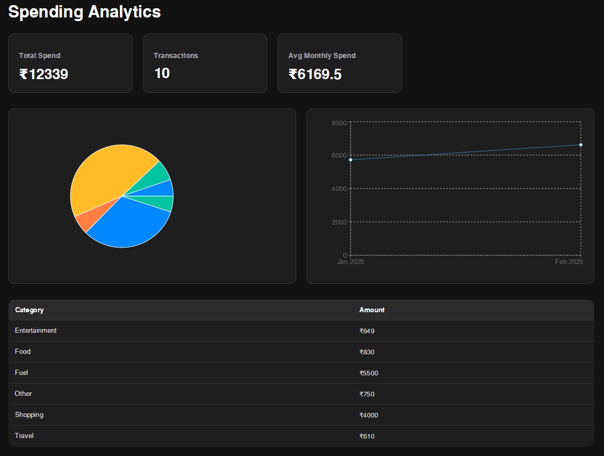
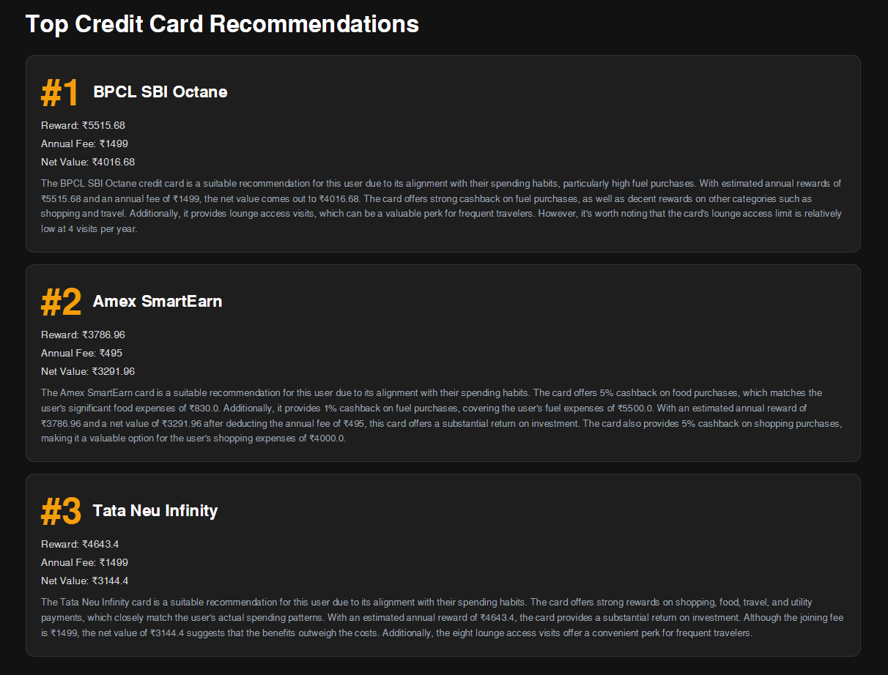
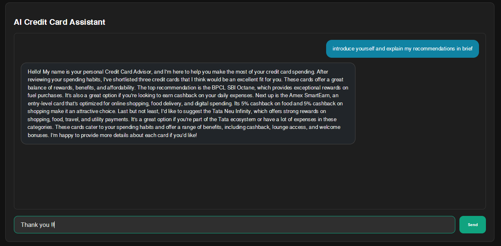

# Credit Card Recommendation System.
## Overview

Choosing the right credit card is difficult because reward structures, annual fees, cashback categories, and spending habits vary from person to person.

This project analyzes a user's transaction history, categorizes expenses, calculates projected rewards across multiple credit cards, and recommends the most suitable cards based on estimated annual value. The system also includes an AI-powered financial assistant built using Retrieval-Augmented Generation (RAG) to explain recommendations and answer user questions.

---

## Features

### Transaction Analysis

* Upload bank or credit card transaction statements (CSV)
* Automatic transaction parsing
* Merchant normalization
* Expense categorization

### Expense Categorization

Transactions are classified into categories such as:

* Food & Dining
* Fuel
* Travel
* Shopping
* Utilities
* Entertainment
* Others

### Analytics Dashboard

* Total spending overview
* Monthly spending trends
* Category-wise spending analysis
* Interactive charts and visualizations

### Credit Card Recommendation Engine

* Compares user spending against available credit cards
* Calculates projected annual rewards
* Adjusts for annual fees
* Generates ranked recommendations
* Returns Top 3 best-fit cards

### AI Financial Assistant

Users can ask questions such as:

* Why was this card recommended?
* Compare Card A vs Card B
* Which card gives better travel rewards?
* How can I maximize cashback?

The assistant uses Retrieval-Augmented Generation (RAG) with vector search and LLM reasoning.

---

## System Architecture

User Uploads CSV <br>
    ↓<br>
React Frontend<br>
    ↓<br>
FastAPI Backend<br>
    ↓<br>
Transaction Processing (Pandas)<br>
    ↓<br>
PostgreSQL Database<br>
    ↓<br>
Recommendation Engine<br>
    ↓<br>
Analytics Dashboard<br>

#### AI Assistant Flow:

User Query<br>
    ↓<br>
LangChain<br>
    ↓<br>
ChromaDB Retrieval<br>
    ↓<br>
Gemini API<br>
    ↓<br>
Response Generation<br>

---

## Tech Stack

### Frontend

* React
* Vite
* CSS
* Recharts

### Backend

* FastAPI
* Pydantic
* SQLAlchemy

### Database

* PostgreSQL

### Data Processing

* Pandas

### AI Components

* Gemini API
* LangChain
* ChromaDB

### Deployment

* Vercel
* Render
* Neon PostgreSQL

---

## Project Structure

```text
Credit-Card-Recommendation-System/
│
├── backend/
│   ├── app/
│   │   ├── auth/
│   │   ├── chroma/
│   │   ├── core/
│   │   ├── data/
│   │   ├── models/
│   │   ├── prompts/
│   │   ├── repositories/
│   │   ├── routes/
│   │   ├── schemas/
│   │   ├── services/
│   │   └── tests/
│   └── sql/
│
├── frontend/
│   ├── public/
│   └── src/
│       ├── components/
│       ├── context/
│       ├── data/
│       ├── hooks/
│       ├── mock/
│       ├── pages/
│       ├── services/
│       └── types/
│
├── database/
│
├── screenshots/
│
├── README.md
└── .gitignore
```

---

## Database Schema

### Transactions

| Column   | Type    |
| -------- | ------- |
| id       | UUID    |
| date     | DATE    |
| merchant | VARCHAR |
| amount   | DECIMAL |
| category | VARCHAR |
| user_id  | UUID    |

### Credit Cards

| Column           | Type    |
| ---------------- | ------- |
| id               | UUID    |
| card_name        | VARCHAR |
| issuer           | VARCHAR |
| annual_fee       | DECIMAL |
| reward_structure | JSON    |
| travel_benefits  | TEXT    |
| cashback_rules   | TEXT    |

---

## API Endpoints

### Health Check

```http
GET /health
```

### Upload Transactions

```http
POST /upload
```

### Fetch Transactions

```http
GET /transactions
```

### Dashboard Analytics

```http
GET /analytics
```

### Card Recommendations

```http
GET /recommendations
```

### AI Assistant

```http
POST /chat
```

---

## Recommendation Methodology

The recommendation engine:

1. Aggregates annual spending by category.
2. Evaluates each credit card reward structure.
3. Calculates projected annual rewards.
4. Deducts annual fees.
5. Computes net value.
6. Ranks cards by expected return.

Formula:

Net Value =
Annual Rewards
− Annual Fee

Cards with the highest net value are recommended.

---

## AI Assistant (RAG Pipeline)

### Knowledge Base

Each credit card contains:

* Rewards
* Cashback rates
* Lounge access
* Travel benefits
* Annual fees
* Eligibility criteria

### Workflow

1. User submits a question.
2. Relevant card information is retrieved from ChromaDB.
3. Context is passed to LLM.
4. LLM generates a grounded response.

---

## Screenshots

### Dashboard



### Recommendation Engine



### AI Assistant



---

## Local Setup

### Clone Repository

```bash
git clone https://github.com/Nitish4144/Credit-Card-Recommendation-System.git

cd Credit-Card-Recommendation-System
```

### Backend Setup

```bash
cd backend

python -m venv venv

source venv/bin/activate

pip install -r requirements.txt

uvicorn app.main:app --reload
```

### Frontend Setup

```bash
cd frontend

npm install

npm run dev
```

### Database Setup

```bash
createdb credit_card_advisor

psql credit_card_advisor < database/schema.sql
```


## Learning Outcomes

This project demonstrates:

* Full Stack Development
* REST API Design
* Database Modeling
* Recommendation Systems
* Retrieval-Augmented Generation (RAG)
* Vector Databases
* LLM Integration
* Software Architecture

## Author

Nitish

Passionate about building practical technology solutions that combine software engineering, data processing, and artificial intelligence.
